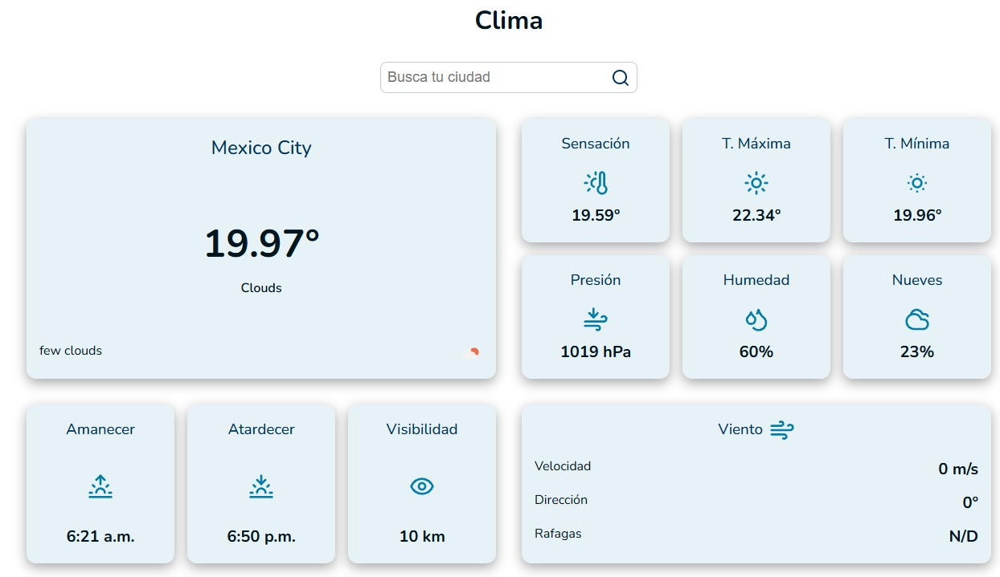
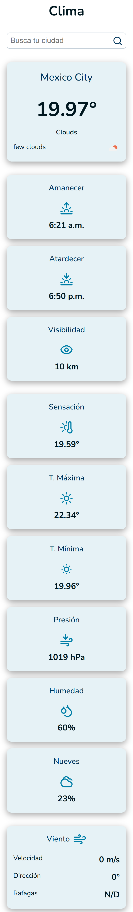
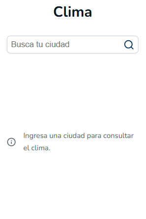
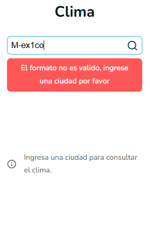

# 🌦️ Weather App

A responsive weather application built with HTML, CSS, and vanilla JavaScript that consumes the OpenWeather API to display real-time weather information for searched cities. The project focuses on API integration, input validation, error handling, Local Storage persistence, responsive UI states, and a modular JavaScript architecture using ES6 modules.

---

## 🚀 Live Demo

🔗

---

## 🎨 Design Inspiration

The interface design was inspired by modern weather applications and UI concepts from Dribbble.

The goal was to take inspiration from existing design patterns and adapt them into an original interface while focusing on usability, responsiveness, and functionality.

Design reference: [Dribbble – Weather Report Website Design](https://dribbble.com/shots/26323000-Weather-Report-Website-Design)

---

## 📸 Screenshots

### Desktop



### Mobile



### Empty State



### Error State



---

## ✨ Features

- Search for cities and retrieve real-time weather information.
- Input validation for city names and user input.
- Weather information including:
  - Current temperature.
  - Feels-like temperature.
  - Minimum and maximum temperature.
  - Atmospheric pressure.
  - Humidity.
  - Wind speed, direction, and gusts.
  - Visibility.
  - Cloud coverage.
  - Sunrise and sunset times.
- Weather condition icons provided by OpenWeather.
- HTTP error handling for common API errors such as:
  - City not found.
  - Unauthorized API requests.
  - Too many requests.
  - Server errors.
- Persistent weather data using Local Storage.
- Empty state when no weather data is available.
- User-friendly error messages.
- Fallback values (`N/D`) when weather information is unavailable.
- Modular JavaScript architecture using ES6 modules.
- Responsive interface for different screen sizes.
- Environment variables for API configuration.

---

## 🛠️ Tech Stack

- HTML5
- CSS3
- JavaScript (ES6 Modules)
- Vite

---

## 📁 Project Structure

```
weather-app/
├── public/
│   ├── android-chrome-192x192.png
│   ├── android-chrome-512x512.png
│   ├── apple-touch-icon.png
│   ├── favicon-16x16.png
│   ├── favicon-32x32.png
│   ├── favicon.ico
│   └── site.webmanifest
│
├── src/
│   ├── assets/
│   │
│   ├── css/
│   │   ├── base/
│   │   │   ├── resets.css
│   │   │   └── variables.css
│   │   ├── components/
│   │   │   ├── card.css
│   │   │   ├── icon.css
│   │   │   └── searchbar.css
│   │   ├── layout/
│   │   │   ├── header.css
│   │   │   ├── layout-app.css
│   │   │   ├── main.css
│   │   │   ├── navbar.css
│   │   │   └── sections.css
│   │   └── style.css
│   │
│   └── js/
│       ├── api/
│       │   └── weather.js
│       ├── logic/
│       │   └── weather.js
│       ├── storage/
│       │   └── weatherStorage.js
│       ├── ui/
│       │   └── weather.js
│       ├── utils/
│       │   ├── date.js
│       │   └── format.js
│       ├── app.js
│       ├── icons.js
│       └── main.js
│
├── docs/
│   └── screenshots/
│       ├── weather-desktop.png
│       ├── weather-mobile.png
│       ├── weather-empty.png
│       └── weather-error.png
│
├── .env.local
├── .gitignore
├── index.html
├── package-lock.json
├── package.json
└── README.md
```

---

## 🎯 Learning Objectives

This project was created to strengthen my JavaScript and frontend development skills through a real-world application.

The main learning objectives were:

- Practice working with external APIs using `fetch`.
- Understand asynchronous JavaScript and API responses.
- Work with HTTP status codes and error handling.
- Practice DOM manipulation and dynamic content rendering.
- Implement client-side input validation.
- Work with Local Storage for data persistence.
- Organize JavaScript code using ES6 modules.
- Separate application responsibilities into API, logic, UI, storage, and utility modules.
- Practice reusable functions and data formatting.
- Improve project organization and maintainability.
- Strengthen Git workflow using branches and focused commits.
- Prepare a JavaScript project for production deployment.

---

## 🔮 Future Improvements

Possible improvements for future versions include:

- Add support for multiple saved cities.
- Allow users to switch between Celsius and Fahrenheit.
- Add a weather forecast for upcoming days.
- Improve weather condition visuals and animations.
- Add loading states while fetching weather data.
- Improve accessibility and keyboard navigation.
- Further refine responsive layouts for different devices.
- Improve API error handling and user feedback.
- Move API requests to a backend or serverless function to keep API credentials outside the client-side application.
- Migrate the project to React as a future frontend practice exercise.

---

## ⚙️ Getting Started

### Clone the repository

```bash
git clone https://github.com/RaulLimon3/Weather-app.git
```

### Install dependencies

```bash
npm install
```

### Start the development server

```bash
npm run dev
```

### Build for production

```bash
npm run build
```

### Preview the production build

```bash
npm run preview
```

---

## 👨‍💻 Author

Developed by **Raúl Limón**  
Frontend Developer focused on building scalable and maintainable web applications while continuously improving JavaScript and frontend architecture skills.

- GitHub: [RaulLimon3](https://github.com/RaulLimon3)  
- LinkedIn: [Raúl Limón]https://www.linkedin.com/in/raul-limon-garcia/

---

## 📄 License

This project was created for educational purposes and portfolio demonstration.